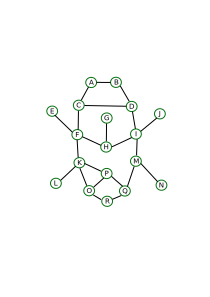

# Jane Street Bug Byte Puzzle

Have you seen this puzzle? 
A number puzzle seemingly from April 2024 [https://www.janestreet.com/bug-byte/] 
This is my writeup of how I approached this puzzle.

We need to put numbers 1-24 on the edges of the graph and fulfill some restrictions.
Some numbers and some sums are given. For more details, I suggest reading the original.
Spoiler warning: I won't post the solution, but I'm certainly going to reveal clues.




## First observations:
- This looks quite unstructured - I gave the nodes some names with letters A through R. See my drawing above.

- some instrcutions where a little unclear (for me, as a non graph theorist):
  "non-self intersecing path from this node" seems to refer to nodes E, C, G and J.
  The route starts at each of these nodes, can go in any direction and ends when the sum is reached. It should not cross a node/edge twice. Looks like this excludes putting a 3 on edge GH and crossing this twice for obtaining the sum of 6.
    
- solving manually: At first, I thought that is something that can be solved by thinking about it.
  Around node B, there need to be numbers 1 and 2 to reach the sum of 3. 
  (Any number from 1-24 must be used only once and 0 is not allowed)
  Then edge AC can be 15 or 16. The condition for C to have a route to anywhere with sum 19 does not help here.
  I quickly lost track of which number I already spent.  It's time to kill it with iron - use more compute!

## Try all combinations with python
In my day job, I'm working in python "all the time". 
But this is for glue code, bugfixing, for extending other peoples work. 
I've never worked with graphs or performance code in python before - but how hard can it be?
I represented the graph as a list of nodes and a list of edges/connections.
In the end I got this to evaluate about 10 combinations per msec on my old Celeron N4100.
Nothing to be proud of ...


## My solution with C and a little C++

Okay - let's try all combinations - how hard can it be?
I'll use a backtracking approach that puts a number, sees if it matches the conditions and trys the next one.
(Backtracking is nicely explained in the [Computerphile Sudoku solver](https://www.youtube.com/watch?v=G_UYXzGuqvM) video).


I decided to use a compact internal representation as a 24 length char array.
This should be plenty to store all weights (no numbers >200, no negative numbers).
I dont see a need to write C++ objects and abstractions. 
We've got maybe ~150 bytes to manage - if we dont waste, its going to be stay in the CPU chace and be faaaaaaast!


### Setup

I'm using gcc with a makefile on an old Ubuntu 20.04 Intel Celeron N4100

```make
bug: bug.cpp
        gcc -Wall -O3 -o bug bug.cpp -lstdc++
```

and the `bug.cpp` file with following includes:
```c
#include <iostream>
#include <iomanip>

int totalcount = 0; // show how many checks we performed
```


### Input definition - the nodes

For each node I need to know the desired sum of edges.
The node names 'A' to 'R' are simply the index into the array and `node[5]` will tell 
me that node F needs a sum of 54.
For `node[3]` there is 0 given (as there is no edge sum check possible).

```c
//                A   B   C   D   E   F   G   H   I   J   K   L   M   N   O   P   Q   R
char nodes[] = { 17,  3,  0,  0,  0, 54,  0, 60, 49,  0, 79,  0, 75,  0, 39, 29, 25,  0}; 
int numberofnodes=18;
```
But how do I make sure that there is no typo in there?
Maybe print out the the nodes and double-check:

```c
void printnodes() {
   std::cout << " ";
   for (int i=0; i<numberofnodes; i++)
      std::cout << " " << char(i+'A') << " ";
   std::cout << std::endl << " ";
   for (int i=0; i<numberofnodes; i++)
      std::cout << std::setw(2) << int(nodes[i]) << " ";
   std::cout << std::endl;
}
```
gives a list of node names with numbers - yes - this looks good!
```
  A  B  C  D  E  F  G  H  I  J  K  L  M  N  O  P  Q  R 
 17  3  0  0  0 54  0 60 49  0 79  0 75  0 39 29 25  0
```

### Input definition - the edges

I also need to define the edges of the graph. 
Each edge is identified by two node names and a weight. I just put zero if it is not yet set.
Ideally, I would like to store a node as chars `{1, 2, 5}` which will be a pain to read.
I chose to write down the ASCII character numbers of the names like this:

```c
unsigned char conns[24][3] = { {'A', 'B', 0}, {'A', 'C', 0}, {'B', 'D',  0}, {'C', 'D', 12},
                               {'E', 'F', 0}, {'C', 'F', 0}, {'K', 'F',  0}, {'F', 'H',  0},
                               {'G', 'H', 0}, {'H', 'I', 0}, {'K', 'H', 24}, {'M', 'H',  0}, 
                               {'D', 'I', 0}, {'I', 'J', 0}, {'M', 'I', 20}, {'L', 'K',  0},
                               {'O', 'K', 7}, {'K', 'P', 0}, {'M', 'N',  0}, {'O', 'P',  0},
                               {'P', 'Q', 0}, {'M', 'Q', 0}, {'Q', 'R',  0}, {'R', 'O',  0} };
int numberofconns=24;
```
The result is a 2D char (byte) array with numbers for the ASCII chars from 'A' 65 and above. 
That is nice to read, but weird for processing. 
I put in some preprocessing whenever my programm starts and simply subtract 'A' (ASCII is soo nice! Dont ask me to make this UTF compliant!)  from each node like this:

```c
  // prepare correct indices, 'A' -> 0
   for (int i=0; i<24; i++) {
       conns[i][0] -= 'A';
       conns[i][1] -= 'A';
   }
```
So I finally have an array that tells me that edge 4 goes from this node number `conns[4][0]` to this node number `conns[4][1]` with the following weight `conns[4][2]`. There is 0 if no weight has been set yet.
And again, I need to check that this is correct:

```c
void printconns(int pos = 100) {
   for (int i=0; i<numberofconns; i++) {
       if ((pos == i) || (pos == i-1)) std::cout << "|";
       else std::cout << " ";
       std::cout << char(conns[i][0]+'A') << char(conns[i][1]+'A');
   }
   if (pos+1 == numberofconns) std::cout << "|";
   std::cout << std::endl;

   for (int i=0; i<numberofconns; i++) {
       if ((pos == i) || (pos == i-1)) std::cout << "|";
       else std::cout << " ";
       std::cout << std::setw(2) << int(conns[i][2]);
   }
   if (pos+1 == numberofconns) std::cout << "|";
   std::cout << std::endl;
}

```
The first part just prints the ABCs,
The second line then prints the current weight of the edge.

```
AB AC BD CD EF CF KF FH GH HI KH MH DI IJ MI LK OK KP MN OP PQ MQ QR RO
 0  0  0 12  0  0  0  0  0  0 24  0  0  0 20  0  7  0  0  0  0  0  0  0
```
Check successful!
The printing function looks rather complex from the output formatting. I used this function a lot for debugging. With `pos` being set to a position, I can also illustrate where we are currently. For `pos=2` this would give some lines around 'BD'. Nice to watch when thousands of lines scroll by. 

```
AB AC|BD|CD EF CF KF FH GH HI KH MH DI IJ MI LK OK KP MN OP PQ MQ QR RO
 0  0| 0|12  0  0  0  0  0  0 24  0  0  0 20  0  7  0  0  0  0  0  0  0
```

### Checking functions - which numbers are available?

We are only allowed to use each number from 1-24 once. Somehow we need to keep track of this.
This is ripe for a off-by-one adressing problem - I'll better associate a 25 array for numbers that can be used 
('1' if number is available, '0' if number is not available).
Using a char for each number is a little excessive, as we would only need a single bit per number only. 
But using individual bits of a 32bit integer would be much more complex and likely not any faster.

```c
char numbers[] = { 0, 0, 0, 0, 0, 0, 0, 0, 0, 0, 0, 0,
                   0, 0, 0, 0, 0, 0, 0, 0, 0, 0, 0, 0, 0};
int numberofnumbers=25;

void updateavailablenumbers() {
    // clear availablenumbers
    for (int i=1; i<numberofnumbers; i++) {
        numbers[i] = 1;
    }
    // scan all conns
    for (int i=0; i<numberofconns; i++) {
        if (conns[i][2] > 0) {
            numbers[ conns[i][2] ] = 0;
        }
    }
    
    // analyze and print
    std::cout << "available numbers: ";
    int count=0;
    for (int i=1; i<numberofnumbers; i++) {
        if (numbers[i] == 1) {
            std::cout << i << " ";
            count++;
        }
    }
    std::cout << std::endl;
    std::cout << " (" << count << " total)" << std::endl;
}
```

At the start, this gives me the following list:

```
available numbers: 1 2 3 4 5 6 8 9 10 11 13 14 15 16 17 18 19 21 22 23   (20 total)
```
If you do not look closely, you will search for a while why this is showing all numbers and not working properly.
Only if you look closely, you can see that 7, 12, 20 and 24 are already missing from the list.

In principle, this function could be run for every step, over and over. 
This is a needless computation and I decided to keep track of the numbers used.
The available numbers array is updated each time a number n was used `numbers[n] = 0;` or given back `numbers[n] = 1;`. This gave another performance increase.


### Checking functions - the node sums 

I need a function that goes through the nodes and sees if the sums are correct/exceeded already.
Checking all nodes would be O(n*m) problem (n number of nodes, m number of edges).
However, while writing this, I realized that when changing a single edge, only two nodes will be affected.
Instead of checking all nodes, checking just the two updated notes got me a 5x speedup.
When updating an edge, we need to run this check for both nodes `conn[i][0]` and `conn[i][1]`.

The node check involves two aspects:
- what is the sum for this node so far? 
- do we still have a 0  weight in the edges? If so, we are not done and the sum will increase in the future

```c
bool checknodesum(int node) {
    totalcount ++;

    if (nodes[node] == 0) {
        return true; // no sum requirement for this node
    }
    int nodesum = 0;
    bool allcomplete = true;
    for (int i=0; i<numberofconns; i++) {
        if ((conns[i][0] == node) || (conns[i][1] == node)) {
            nodesum += conns[i][2];
            if (conns[i][2] == 0)
                allcomplete = false;
        }
    }

    if (allcomplete) {
        if (nodesum != nodes[node]) {
            return false; // node is complete, but wrong sum
        }
    }
    else {
        if (nodesum >= nodes[node]) {
            return false; // node incomplete, but number too high
        }
    }

    return true;
}
```

The second half of this function will analyze the results:
- allcomplete: all eddges for this node have a number assigned.
  - the sum does not match, we can abort. What we currently have is not a solution
  - else: the computed sum is the correct sum as expected. good!
- not allcomplete: this node has still some edges that are unkown and show 0
  - if the sum of edges is already at or above, we know it is already too large and the can abort. Filling the other edges would only increase the sum later on. 
  - else: can be ok - we need to wait.


### Backtracking - put a number and see if it works
Here is where the backtracking magic happens. 
We'll put in the next available number and see if the sums are still good.
If yes - contine and put the next number (recursively).
If not, remove the number and try another one.

We have a function that operates on edge number `pos`, starting from 0. In case of success,
the function fillandtest is called for the next edge.
First of all, there are some checks needed:
- if we reached the end of the edge list, we are done. Hooray - we found a solution!
- if the current edge number if already filled - good, go to the next.

Then we iterate through all numbers.
First of all - check if the number is still available.

The special condition were added - this repects some of the "non-self-intersecting path" requirements.
Without them, there would be 48 possible solutions to the puzzle.
Checking thise simple condition reduced the candidates to just 2 (which I later checked manually... yea - lazy)

```c
void fillandtest(int pos) {
    if (pos == numberofconns) {
        std::cout << "success! this is the end:" << std::endl;
        printconns(pos);
        return;
    }

    if (conns[pos][2]>0) {
        return fillandtest(pos+1); // was already filled
    }

    for (int n=1; n<numberofnumbers; n++) {
        if (numbers[n] == 0) continue;

        // special J-I, pos 13, needs to be 8 or less
        if (pos==13) {
           if (n>8) continue;
        }

        // set number and check
        conns[pos][2] = n;
        numbers[n] = 0;
        if (checknodesum( conns[pos][0] ) && checknodesum( conns[pos][1] )) {
            fillandtest(pos+1);
        }
        // roll back
        numbers[n] = 1;
        conns[pos][2] = 0;
    }
}
```

### Results - putting it together

Okay - finally the main function for calling all the others:
```c
totalcount = 0; // show how many checks we performed
int main() {
   // prepare correct indices, 'A' -> 0
   for (int i=0; i<24; i++) {
       conns[i][0] -= 'A';
       conns[i][1] -= 'A';
   }

   // known from restrictions on G-H
   conns[8][2] = 6;

   printnodes();
   printconns();

   updateavailablenumbers();
   fillandtest(0);

   std::cout << "total count " << totalcount << std::endl;
   return 0;
}
```

On my outdated Celeron N4100 with Ubuntu 20.04 this now runs in ~0.22 seconds and checks 3.7M node placements.
Brute forcing this problem seemed to be okay.
In between, the first succcessful C++ version ran for ~5 seconds,
but mostly printing of millions of rows was slowing things down.

At first I got a larger list of matches. But remember? 
There were special conditions that I neglected at first.

With manual visual checking of the results, I got the following:
- as expected, A-B-D was always 1 and 2
- without the G-H restriction, I found 48 solutions. Those pointed me to the G-H problem and
  I could refine the initialization.
- for edge J-I also got numbers >8. I added a condition that disallows numbers >8 for this node
- finally, I was down to two solutions that had E-f and C-F swapped. Only one of them matched the special conditions for nodes E amd C. Then only a single unique solution is left.


Edge G-H: the special restriction on this edge can be "solved" manually
- for the non-self-intersecting path, a path of sum 6 is required. The node G-H thus cannot be >6
- the numbers 1 and 2 are already used around node B, so 1 and 5 as well as 2 and 4 are not possible
- 3 would be possible, but then the sum of 3 is not possible
- I thus added  `conns[8][2]=6` to the initizalization


## Closing thoughts

- That was a fun exercise and I took a few detours in adding checks and more debugging.
  It is rare, that I'm able to spend a rainy day at the computer and dig deep into a challenge.

- Python: Why I ended up running an early version of this code for 35 minutes in Python is beyond me.
  With Python I got to about 10 test in 10msec, with C++ I'm at around 170k tests in 10msec.
  Don't take this as a Python problem, but rather that I'm feeling more at home with the bits and bytes directly.

- Maybe this is still duplicating computations. I'm out of ideas on how to speed up further.
  It was a good strategy to start with duplicate computation and excessive checks and optimize along the way.

- I'm curious about other solutions and results. 
  I would be happy to see and discuss other solutions and I'm certainly willing to share my code!
  Let me know of a [BRC](https://1brc.dev/) type of scoreboard.

- Please contact me if anything is unclear. 
  If you find the readthrough interesting, let me know.

- That code might even run well on a microcontroller!

